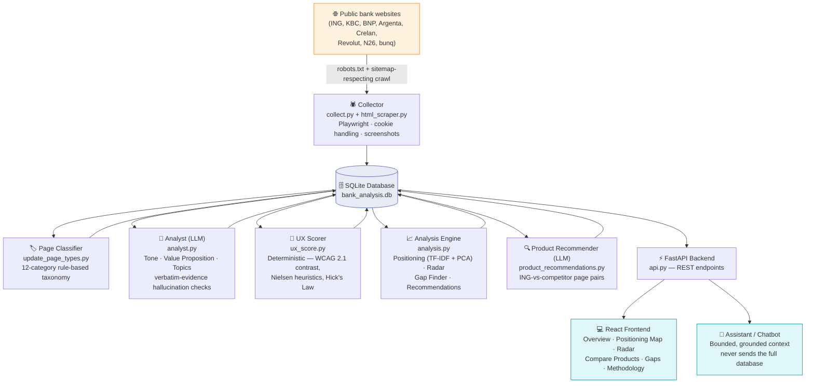

<div align="center">

# 🏦 ING Banking Campaigns Comparator

**A data-driven competitive intelligence platform comparing how banks present marketing campaigns online.**

Built during the BeCode AI & Data Science Bootcamp, in partnership with ING.

[](https://www.python.org/)
[](https://react.dev/)
[](https://fastapi.tiangolo.com/)
[](https://playwright.dev/)
[](https://www.sqlite.org/)
[]()

### 🚀 [**Live Demo →** ing-campaign-comparator-app.onrender.com](https://ing-campaign-comparator-app.onrender.com/)
*Hosted on Render's free tier — the backend may take ~30–60s to wake up on the first request after a period of inactivity.*

[Overview](#-overview) • [Key Numbers](#-key-numbers) • [How It Works](#%EF%B8%8F-how-it-works) • [Features](#-features) • [Setup](#-setup--installation) • [Team](#-team)

</div>

<br>


<p align="center"><i>The Overview tab: Dataset scale at a glance before diving into any single comparison.</i></p>

<br>

## 📌 Overview

In Belgium, banks don't present themselves the same way. Traditional players (ING, KBC, BNP Paribas Fortis) and challenger neobanks (Revolut, N26, bunq) use very different tones, visuals, and value propositions to attract customers.

This project answers, with data rather than opinion:

- **Where does ING stand compared to competitors?**
- **Is ING closer to traditional banks or to challenger banks?**
- **Which banks communicate similarly, and where do campaigns actually differ?**
- **Where are the concrete opportunities for ING to improve?**

It does this by scraping publicly available campaign pages, using an LLM to extract structured, comparable features from each page (tone, value proposition, topics), computing deterministic scores grounded in established usability principles, and surfacing everything through an interactive web app — including a chatbot that answers questions grounded in the actual scraped data.

This is not a one-off report. It's a reusable **feature-extraction framework**: a webpage in, a structured row out — designed to extend to social ads, app banners, and larger-scale automated analysis beyond this project's scope.

<br>

## 📊 Key Numbers

<div align="center">

| Metric | Value |
|---|---|
| 🏦 Banks analyzed | **8** (5 traditional, 3 neobanks) |
| 📄 Campaign pages scraped | **3,000+** |
| 🗂️ Page-type categories (taxonomy) | **12** |
| 🎯 Priority categories analyzed by LLM | **4** (current accounts, youth, cards, savings & investments) |
| 🧭 Radar scoring dimensions | **5** (promo intensity, visual richness, colour vibrancy, content density, topic diversity) |
| ✅ UX sub-scores per page | **6** (value clarity, CTA clarity, hierarchy, scannability, visual balance, accessibility/contrast) |
| 🤖 LLM providers supported | **2** (Groq + Gemini, hot-swappable) |
| 🌍 Languages handled natively | **3** (English, French, Dutch) |

</div>

<br>

## 🗺️ How It Works

The pipeline runs end-to-end, from raw public web pages to an interactive comparison tool:



**In short:** scrape responsibly → classify pages → let an LLM read each page the way a marketer would → score what can be measured deterministically → surface it all through a web app a business stakeholder can actually use.

<br>

## ✨ Features

| Module | What it answers |
|---|---|
| 🏠 **Overview** | How many pages, banks, and categories are in scope — the dataset at a glance |
| 🧭 **Positioning Map** | Who does ING communicate *like*? Pages plotted by similarity in tone, topic, and messaging |
| 📊 **Radar** | How does ING *score* on each dimension compared to competitors — strengths and weaknesses |
| ⚖️ **Compare Products** | Side-by-side ING vs. competitor pages per product category, with a deterministic UX score and an LLM-generated, evidence-grounded recommendation |
| 🕳️ **Gaps** | Topics competitors cover that ING currently doesn't — candidate whitespace, each with a measured (not hyped) recommendation |
| 💬 **Ask** | A chatbot that answers questions about the dataset, grounded in real scraped content — never a hallucinated guess |
| 📖 **Methodology** | Full transparency for a data/technical audience — how every score is computed, and its limitations |

<br>

## 🖼️ Visuals

A walkthrough of what each module actually looks like, and what it's showing.

<br>

<p align="center"></p>

**Positioning Map.** Every dot is one scraped page, plotted in 2D using TF-IDF + PCA over its tone, value proposition, and topics — pages that read alike sit close together, regardless of bank. Colour marks the bank. This is the fastest way to see the headline finding at a glance: whether ING's dots cluster nearer the traditional banks or drift toward the neobank cluster, and which competitor ING most resembles in a given product category. The category filter above the chart narrows this to one product line at a time (e.g. only savings pages), since "similar" only means something within a comparable category.

<br>

<p align="center"></p>

**Radar.** Where the Positioning Map shows *similarity*, this shows *strength* — each bank's shape across five dimensions (promo intensity, visual richness, colour vibrancy, content density, topic diversity), normalized 0–1 so every bank is comparable on one chart. A bank's shape leaning outward on an axis means it leads competitors there; leaning inward flags a relative weak point. Read this alongside the Positioning Map: positioning tells you who ING resembles, radar tells you what to actually do differently from them.

<br>

<p align="center"></p>

**Compare Products.** The most actionable tab for a business audience. Pick a category, and ING's page sits next to the closest competitor equivalent, each with a deterministic UX score (grounded in WCAG 2.1 contrast rules, Nielsen's usability heuristics, and Hick's Law — not an LLM's opinion) and a specific, LLM-generated recommendation on what the competitor does differently and worth considering. This is designed to answer "so what should we actually change?" directly, rather than leaving that inference to the reader.

<br>

<p align="center"></p>

**Ask (Assistant).** A chatbot scoped to this dataset only — every answer is grounded in the actual scraped page content it retrieves for that question, not a general knowledge guess, and it never sends the full multi-thousand-page database to the model (that would blow the context window; instead it retrieves only the pages relevant to what's asked). Useful for exploring a question live in a meeting rather than pre-building every chart someone might ask for.

<br>

## 🧱 Tech Stack

## 🧱 Tech Stack

<div align="center">

| Layer | Technology |
|---|---|
| Scraping | Playwright (Firefox), Python |
| Storage | SQLite |
| Feature extraction | LLM (Groq / Gemini, OpenAI-compatible API), verbatim-evidence verification |
| Scoring | Deterministic Python — WCAG 2.1 contrast math, Nielsen's heuristics, Hick's Law |
| Analysis | pandas, scikit-learn (TF-IDF, PCA) |
| Backend | FastAPI |
| Frontend | React (Vite), Recharts |

</div>

<br>

## ⚖️ Legal & Data Scope

Only publicly available content was collected. Before scraping, each bank's `robots.txt` and sitemap were reviewed and respected — no restricted paths were accessed, no personal data was collected, and no access restrictions were bypassed. See [Methodology](#-features) in-app for the full per-bank compliance notes.

<br>

## 🚀 Setup & Installation

```bash
# 1. Clone and enter the project
git clone https://github.com/UzairSaeedKhan/ing-campaigns-comparator.git
cd ing-campaigns-comparator

# 2. Python environment
pip install -r requirements.txt --break-system-packages
playwright install firefox

# 3. Configure an LLM provider (either works)
export LLM_PROVIDER=groq          # or "gemini"
export GROQ_API_KEY=gsk_...       # or GEMINI_API_KEY

# 4. Run the pipeline
python main.py --banks all --scroll

# 5. Frontend
cd app
npm install
npm run dev

# 6. Backend API
uvicorn api:app --reload
```

<br>

## 📁 Project Structure

```
.
├── config/
│   ├── banks.yaml            # bank definitions, sitemap links, keywords
│   └── page_types.yaml       # 12-category page classification taxonomy
├── src/
│   ├── collect.py            # scraping orchestration
│   ├── cookies.py            # cross-platform cookie-consent handling
│   ├── html_scraper.py       # content extraction
│   ├── insertion_db.py       # database writes
│   ├── extract_colors.py     # dominant color extraction
│   ├── llm_client.py         # Groq / Gemini abstraction
│   ├── analyst.py            # LLM feature extraction (tone, value prop, topics)
│   ├── analysis.py           # positioning, radar, gaps, recommendations
│   ├── ux_score.py           # deterministic UX scoring
│   ├── product_recommendations.py
│   └── assistant.py          # grounded, bounded-context chatbot logic
├── app/                      # React frontend
├── api.py                    # FastAPI backend
├── main.py                   # pipeline entrypoint
├── data/
│   └── bank_analysis.db      # SQLite database
└── assets/                   # README images
```

**Images used in this README:**
| File | Used in |
|---|---|
| `hero-overview.png` | Top banner — Overview tab |
| `positioning-map.png` | Visuals — Positioning Map |
| `radar-chart.png` | Visuals — Radar |
| `compare-products.png` | Visuals — Compare Products |
| `chatbot.png` | Visuals — Ask (Assistant) |

<br>

## 👥 Team

<div align="center">

| | Name | Role | Links |
|---|---|---|---|
| 🧭 | **Uzair Saeed Khan** | Team Lead | [](https://github.com/UzairSaeedKhan) [](https://www.linkedin.com/in/uzairsaeedkhan/) |
| 👩‍💻 | **Iness Khatiri** | Contributor | [](https://github.com/Happiness910) [](https://www.linkedin.com/in/iness-khatiri-14392a258/) |
| 👨‍💻 | **Max Huberland** | Contributor | [](https://github.com/Max96H) [](https://www.linkedin.com/in/max96h/) |
| 👩‍💻 | **Hiba Amellal** | Contributor | [](https://github.com/amellalajiba-sys) [](https://www.linkedin.com/in/amellal-hiba-7a636940a/) |

</div>

<br>

## 📄 License

Academic project — built for BeCode's AI & Data Science Bootcamp in collaboration with ING.

<div align="center">

<br>

**Built with 🧡 by the ING Campaigns Comparator team**

</div>